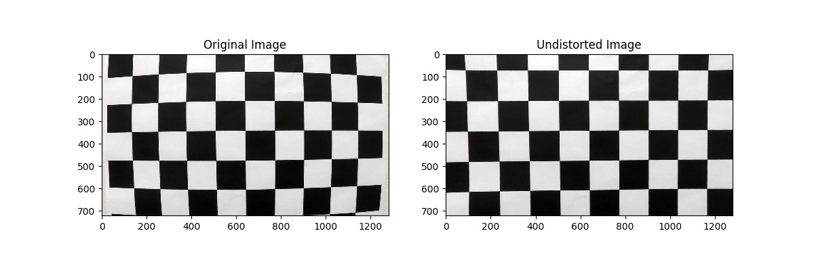
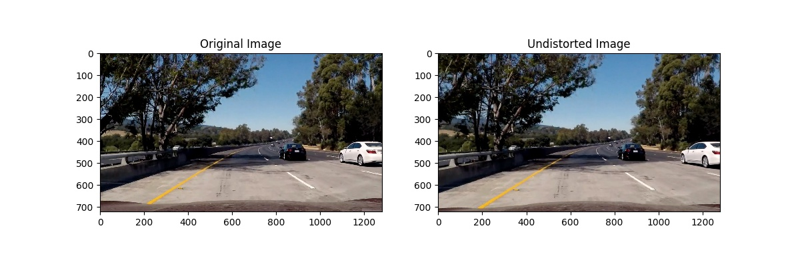

# Advanced Lane Lines (Project 4 of Udacity CarND)

My implementation of this project is presented in [the LaneLineFinder module](LaneLineFinder) and [the jupyter notebook](Advanced-Lane-Lines-P4.ipynb) alternatively. This writeup will discrible how I achieve the project, but I **strongly recommend** reading the [jupyter notebook](Advanced-Lane-Lines-P4.ipynb) directly, which includes both code and illustrations.

This writeup consists of 7 sections as followed:
- Camera Calibration
- Binary Filter for Lane Lines
- Perspective Warp
- Fitting Lane Lines
- Pipline for Finding Lane Lines (Image)
- Pipline for Finding Lane Lines (Video)
- Discussion

---

## Section 1: Camera Calibration

This section presents the method I did camera calibration. I designed a `CameraCalibrator`. During calibrating, it searches valid chessboard pattens from 9×6 to 2×2 from chessboard calibration images. The `CameraCalibrator` offers an `undistort` function to undistort camera images using calibrated matrixes. It also offers `save_matrix` and `load_matrix` methods.

The code implementation can be found in [calibrate.py](LaneLineFinder/calibrate.py) and Section 1 of the [jupyter notebook](Advanced-Lane-Lines-P4.ipynb).

Here are examples of a calibrated chessboard image and a test image.

---

## Section 2: Binary Filter for Lane Lines

In this section, I designed a `LaneLineFilter` to extract lane line pixels from a camera image into a binary image. I **spared no effort** in trying to find out the best way to extract line pixels. Finally I got the following tricks:
- **Use LAB color space.** L channel is actually the grayscale of the image, I did sobel gradient calculation on this channel. And B channel actually represents how ***yellow*** the image is, which is perfect to detect yellow line pixels.
- **Gaussian smooth the absolute sobel gradients.** This to some extent reduces the noise pixels of the sobel results.
- **Take median-value filtering.** For L & B channels, the pixels smaller than their median value are set to the median. This is pretty cool since it filtered some darker but not lane line pixels, making the sobel gradients clean. This is especially useful when processing `challenge_video.mp4`.

The code implementation can be found in [linefilter.py](LaneLineFinder/linefilter.py) and Section 2 of the [jupyter notebook](Advanced-Lane-Lines-P4.ipynb).

Here is an example of filtered line pixels. The result is pretty cool, without too much noise pixels.

---

## Section 3: Perspective Warp

I designed a class named `WarpPerspective`, it offers both warp and inverse warp methods. The default source and destination points are (based on image size of 1280\*720):

| src points | dst points |
|:----------:|:----------:|
|  572, 450  |  160,   0  |
|    0, 720  |  160, 720  |
| 1280, 720  | 1120, 720  |
|  702, 450  | 1120,   0  |

>**NOTE** The default `src` and `dst` points are for the images in `test_images/` and `project_video.mp4`.

The code implementation can be found in [warp.py](LaneLineFinder/warp.py) and Section 3 of the [jupyter notebook](Advanced-Lane-Lines-P4.ipynb).

Here is an example of a warped and undistorted image. The warped image shows two parallel straight lines.

---

## Section 4: Fitting Lane Lines

In this section, I designed a `LaneLineFitTool` collecting several kinds of method locating and fitting lane lines. This is the step right after having a warped and undistorted binary image. It includes line pixel locating methods, fitting methods, visualization methods and calculations of line curve radius and vehicle postion on the road.

The code implementation can be found in [fittool.py](LaneLineFinder/fittool.py) and Section 4 of the [jupyter notebook](Advanced-Lane-Lines-P4.ipynb).

Here is an example illustrating the pipline processing an image from its original format to fitting result. I think it's pretty cool. ^_^

---

## Section 5: Pipline for Finding Lane Lines (Image)

In this section, I integrated the pipline of detecting lane lines from an image into one class. This pipline **only use blind search** method to locate lane lines. I applied this pipline to all test images, the results were perfect. Actually, for `project_video.mp4` only, this pipline is good enough to process most frames with perfect results.

The code implementation can be found in [linefinder4image.py](LaneLineFinder/linefinder4image.py) and Section 5 of the [jupyter notebook](Advanced-Lane-Lines-P4.ipynb).

Here are two examples using `LaneLineFinder4Image`. The result seems perfect. And both line curvature radius and vehicle position on the road are presented with reasonable values.

The processed results of the test images in `test_images/` are located in [`output_images/`](output_images).

The processed [video](project_video_out_0.mp4) of `project_video.mp4` applying `LaneLineFinder4Image` is not bad, though sometimes seems not very stable.

---

## Section 6: Pipline for Finding Lane Lines (Video)

In this section, I designed a tool to find lane lines in a video. The main steps are as below:
- Locate line pixels (by either blind search or fit margin, blind search in the first frame);
- Fit line pixels and check sanity, record good fits up to n records;
- When there are bad fits, use previous good fits;
- When too may bad fits (may lose track), relocate line pixel by blind search;
- Return averaged good fits over last n records.

The code implementation can be found in [linefinder4video.py](LaneLineFinder/linefinder4video.py) and Section 6 of the [jupyter notebook](Advanced-Lane-Lines-P4.ipynb).

The [result](project_video_out.mp4) for `project_video.mp4` seems perfect! ^_^

For `challenge_video.mp4`, it has a different perspective. The pipeline also correctly mapped out curved lines and passed shadows regions (see [link](challenge_video_out.mp4)).

---

## Section 7: Discussions

The `LaneLineFinder4Video` has done a good job on both `project_video.mp4` and `challenge_video.mp4`. However, `harder_challenge_video.mp4` is beyond the ability of my pipline. In the future, I may try to use DL image segmentation methods to tackle the big challenge.
